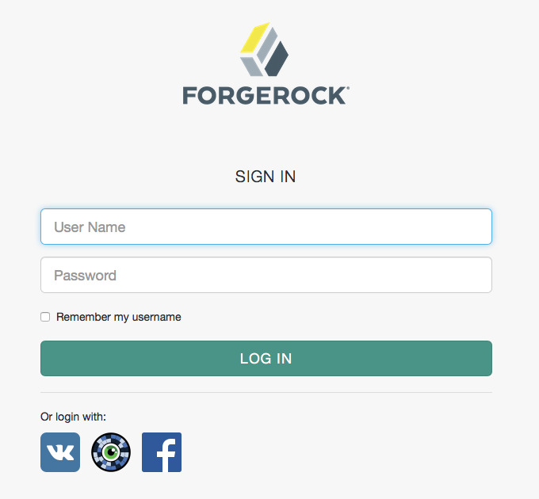

# Winkk Passport Authentication Module

[Winkk Passport](https://passport.winkk.com/partner) is a service that acts as password-free secured online identity provider utilizing patented optical label recognition technology. Winkk Passport supports generic scenarios including OAuth and SAML authentication.
Winkk Passport mobile application is required to follow the authentication process. It is available at [AppStore](https://itunes.apple.com/us/app/winkkpass-fast-secure-login/id1166258885) and [Play Market](https://play.google.com/store/apps/details?id=com.winkk.winkkpass).
Winkk Passport can be configured as external Access Manager OAuth2 identity provider. The step-by-step manual is outlined below.

## Integration manual
The steps of reference integration constructing are listed below.

* Deploy Access Manager 5.5 as described in the [ForgeRock manual](https://backstage.forgerock.com/docs/am/5.5/quick-start-guide).
* Create OAuth2 interface at [Winkk Passport Partner Tool](https://passport.winkk.com/partner) as described in the [Winkk Passport manual](https://passport.winkk.com/partner/#oauth2-manual).
* Go to AM realm dashboard. Open “Authentication - Modules”.
* Click “(+) Add Module”.

* Fill the form.

    + Name: ```“Winkk"```

    + Type: ```“Social Auth OAuth2" ```

* Click “Create”.

* Fill the form.

    + Social Provider: ```“Winkk”```
    + Client Id: ```The OAuth2 application # from Partner Tool ```
    + Client Secret: ```The OAuth2 application secret from Partner Tool ```
    + Authentication Endpoint URL: ```“https://passport.winkk.com/oauth2a/auth”```
    + Access Token Endpoint URL: ```“https://passport.winkk.com/oauth2a/token”```
    + User Profile Service URL: ```“https://passport.winkk.com/oauth2a/userinfo”```
    + Use Basic Auth: ```Off```

* Click “Save Changes”.

* Go to “Account Provisioning” tab.

* Fill the form.

    + Account Provider: ```“org.forgerock.openam.authentication.modules.common.mapping.DefaultAccountProvider”```
    + Account Mapper: ```“org.forgerock.openam.authentication.modules.common.mapping.JsonAttributeMapper|*|winkk-“```
    + Account Mapper Configuration: ```“id=iplanet-am-user-alias-list”```
    + Attribute Mapper: ```“org.forgerock.openam.authentication.modules.common.mapping.JsonAttributeMapper|iplanet-am-user-alias-list|winkk-“```
    + Attribute Mapper Configuration: ```“personal.last_name=sn id=uid email.email=mail personal.nickname=cn personal.first_name=givenName”```

* Click “Save Changes”.
* Go to “Authentication - Chains”.
* Click “(+) Add Chain”.

* Fill the form.

    + Name: ```“WinkkSocialAuthenticationService”```

* Click “Create”.
* Click “(+) Add a Module”.

* Fill the form.

    + Select Module: ```“Winkk”```
    + Select Criteria: ```“Required”```

* Click “Ok”.

* Click “Save Changes”.

* Go to “Authentication - Settings”.

* Go to “User Profile” tab.

    + Select User Profile: ```“Ignored”```

* Click “Save Changes”.

* Go to “Services”.

* Click “Social Authentication Implementations”.

* Fill the form “Display Names”.

    + Key: ```“Winkk”```
    + Value: ```“Winkk”```

* Click “(+) add”.

* Fill the form “Authentication Chains”.

    + Key: ```“Winkk”```
    + Value: ```“WinkkSocialAuthenticationService”```

* Click “(+) add”.

* Fill the form “Icons”.

    + Key: ```“Winkk”```
    + Value: ```“https://passport.winkk.com/img/winkk_450.png”```

* Click “(+) add”.

* Fill the form “Enabled Implementations”.

    + Add ```“Winkk” ```

* Click “Save Changes”.

## Test the integration

Go to some page that is protected via Access Manager.
* Winkk identity provider should be available as a “HyperEye” icon at the bottom of the page among the other social identity providers.
 



# Disclaimer
The sample integration setup described herein is provided on an "as is" basis, without warranty of any kind, to the fullest extent permitted by law. Winkk does not warrant or guarantee the individual success developers may have when following the integration manual on their development platforms or in production configurations.
Winkk does not warrant, guarantee or make any representations regarding the use, results of use, accuracy, timeliness or completeness of any data or information relating to the integration manual. Winkk disclaims all warranties, expressed or implied, and in particular, disclaims all warranties of merchantability, and warranties related to the integration manual, or any service or software related thereto.
Winkk shall not be liable for any direct, indirect or consequential damages or costs of any type arising out of any action taken by you or others related to the integration manual.
